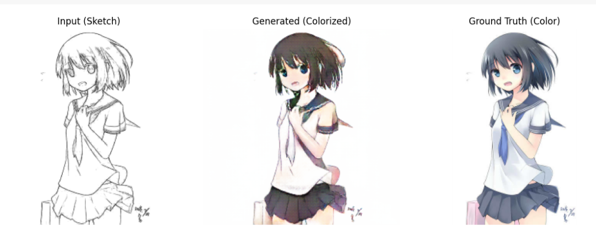

# 🎨 Pix2Pix Anime: Sketch to Colorized Anime Image Translation

Pix2Pix Anime is a deep learning project that translates black-and-white anime sketches into fully colorized anime-style images using the Pix2Pix image-to-image translation framework. This model leverages paired training data consisting of sketches and their corresponding colored versions to learn a conditional mapping from outlines to artwork.

## 🚀 Overview

The project uses a U-Net-based generator and a PatchGAN discriminator, trained adversarially using a combination of L1 loss and GAN loss. The generator aims to produce colorized anime images that are not only visually convincing but also closely match the ground truth. The discriminator encourages outputs that look locally realistic, enhancing texture and style fidelity.

## 🧠 Model Architecture

- **Generator**: U-Net with skip connections for preserving spatial features.
- **Discriminator**: PatchGAN for high-frequency realism.
- **Loss**: Adversarial loss (GAN) + L1 pixel-wise loss.

## 🔄 Training Pipeline

- **Dataset**: Used a paired dataset of anime sketches and corresponding colored images.  
- **Preprocessing**: Images resized to 256×256 and normalized to [-1, 1].  
- **Training**: Generator and discriminator trained alternately using the original Pix2Pix objective.  
- **Evaluation**: Visual comparison of generated colored images with ground truth for qualitative performance.

## 🔧 Features

- High-quality sketch-to-color translation  
- Real-time output visualization during training  
- Easy-to-follow dataset and environment setup  
- Fully reproducible training pipeline

## 📈 Results

The trained model generates visually appealing anime-style color images from simple sketches, demonstrating the power of supervised GANs in creative AI applications.

## 📚 References

- Isola et al., 2017 – Pix2Pix: *Image-to-Image Translation with Conditional Adversarial Networks*

## 🧑‍🏫 Mentors
- Akshat Bharara
- Rudra Gandhi

## 🧑‍💻 Mentees/Contributors
- Saivinathi Korukonda
- Vivek Kashyap
- Rushi Patel
