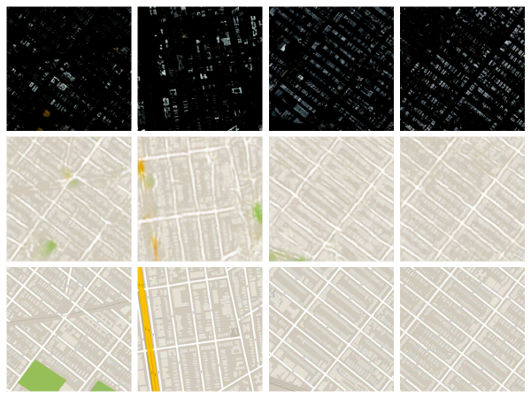

# Pix2Pix_Envision2025

## 🛰️ Description

This project focuses on translating satellite imagery into map-like representations using image-to-image translation. Leveraging the **Pix2Pix** architecture, we employ a supervised learning approach on the [Maps dataset](https://phillipi.github.io/pix2pix/datasets/), which consists of paired satellite and map images. 

To improve training stability and potentially generate sharper outputs, the original **Pix2Pix loss function** has been replaced with the **Wasserstein GAN (WGAN) loss**. This modification alters the training dynamics to encourage a more meaningful gradient flow and reduce common GAN issues like mode collapse.

---

## 🧩 Solution Overview

### 🔧 Model Architecture

- **Generator**: A U-Net-based architecture that learns to map satellite images to map renderings.
- **Discriminator**: A PatchGAN-style discriminator, adapted to support the WGAN loss and trained to evaluate local image realism.
- **Loss Function**: Replaced the standard L1 + GAN loss with the WGAN loss (with gradient penalty for stability).

### 🔄 Training Pipeline

1. **Dataset**: Used the Maps dataset with aligned satellite ↔ map image pairs.
2. **Preprocessing**: Images resized to 256×256 and normalized to [-1, 1].
3. **Training**: Generator and discriminator trained alternately, enforcing the WGAN framework.
4. **Evaluation**: Visual comparison of generated maps with ground truth for qualitative performance.

---

## ✨ Features

- ✅ Satellite to map image translation
- ✅ Modified Pix2Pix with WGAN loss for enhanced training stability
- ✅ U-Net generator and PatchGAN discriminator
- ✅ Real-time sample visualization during training
- ✅ Fully reproducible training with clear dataset and environment setup
- ✅ Optional: Gradient penalty term for robust WGAN training

---

## 🖼️ Sample Result

Below is a sample output from the model after training:

## 📚 References

- [Isola et al., 2017. Image-to-Image Translation with Conditional Adversarial Networks (Pix2Pix)](https://arxiv.org/abs/1611.07004)
- [Arjovsky et al., 2017. Wasserstein GAN](https://arxiv.org/abs/1701.07875)
- [Gulrajani et al., 2017. Improved Training of Wasserstein GANs (WGAN-GP)](https://arxiv.org/abs/1704.00028)

---

